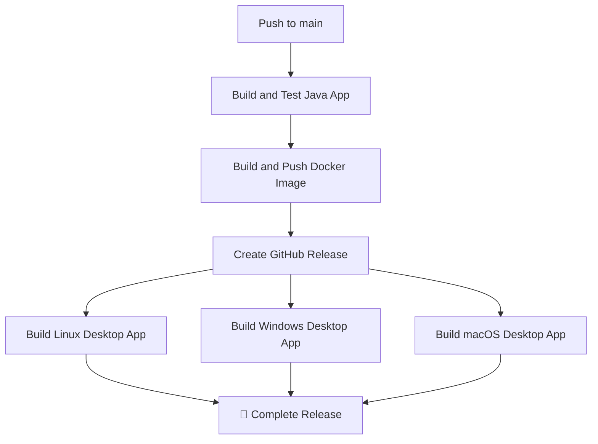

# 🚀 Unified Release Workflow

Your GitHub Actions workflow now handles **both Docker deployment AND desktop app releases** in a single, streamlined process!

## 📋 Workflow Overview

**Trigger**: Push to `main` branch → **One unified workflow does everything**



## 🔄 Step-by-Step Process

### 1. **Backend Build & Test**
- ✅ Java 25 + Gradle build
- ✅ Run all tests
- ✅ Validate application

### 2. **Docker Deployment**
- ✅ Multi-arch build (linux/amd64, linux/arm64)
- ✅ Push to Docker Hub: `lhamacorp/knotes:latest`
- ✅ Deploy to https://notes.lhamacorp.com

### 3. **Desktop Release Creation**
- ✅ Create GitHub Release with version tag
- ✅ Professional release notes (Docker + Desktop info)
- ✅ Prepare for desktop app uploads

### 4. **Cross-Platform Desktop Builds** *(Parallel)*
- 🐧 **Linux**: `.AppImage` file (~104MB)
- 🪟 **Windows**: `.exe` installer (~120MB)
- 🍎 **macOS**: `.dmg` installer (~115MB)

## 📦 What Users Get

### 🐳 **Docker Users**:
```bash
docker pull lhamacorp/knotes:latest
docker run -p 8080:8080 lhamacorp/knotes:latest
```

### 💻 **Desktop Users**:
- Visit: `https://github.com/lhamacorp/knotes/releases/latest`
- Download appropriate file for their OS
- Get automatic update notifications

## ⚡ **Advantages of Unified Workflow**

### ✅ **Single Deploy Process**
- One push to main = Everything deployed
- No separate workflows to manage
- Consistent versioning across Docker + Desktop

### ✅ **Synchronized Releases**
- Docker deployment happens first
- Desktop apps built with latest frontend
- Desktop apps connect to freshly deployed API

### ✅ **Professional Release Notes**
```markdown
## 🚀 kNotes Release - Docker + Desktop Apps

### 🐳 Docker Deployment:
- Image: lhamacorp/knotes:latest
- Deployed to: https://notes.lhamacorp.com

### 📱 Desktop Apps:
- Windows: Download .exe installer
- macOS: Download .dmg installer
- Linux: Download .AppImage file
```

### ✅ **Efficient Resource Usage**
- Builds run in optimal order
- Parallel desktop builds (faster)
- Single GitHub release for everything

## 🎯 **Your New Deployment Flow**

```bash
# Make any change (frontend, backend, or both)
git add .
git commit -m "Update application"
git push origin main

# GitHub Actions automatically:
# 1. ✅ Tests and builds Java app
# 2. ✅ Deploys Docker to production
# 3. ✅ Creates GitHub release
# 4. ✅ Builds desktop apps for all platforms
# 5. ✅ Users get update notifications

# Result: Full-stack deployment in ~10-15 minutes! 🚀
```

## 🔧 **Workflow Files**

- ✅ **Main**: `.github/workflows/buildAndRelease.yml` (unified)
- ❌ **Removed**: `desktop-release.yml` (merged in)
- ❌ **Removed**: `test-desktop-release.yml` (no longer needed)

## 🎉 **Benefits Summary**

- **🔄 One workflow** handles everything
- **⚡ Faster** parallel desktop builds
- **📋 Better** release management
- **🎯 Simpler** deployment process
- **🔒 Consistent** versioning
- **👥 Better UX** for users (Docker + Desktop in same release)

Your release process is now **fully automated and professional**! 🚀