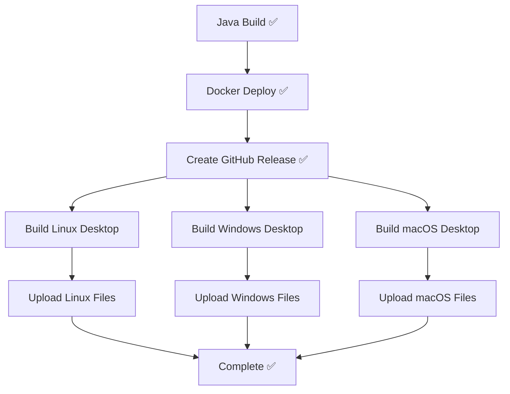

# 🔧 Desktop Build Workflow Fix

## ❌ **Problem:** electron-builder Publishing Failed

All three OS builds were failing because electron-builder couldn't find or access the GitHub releases:
```
⨯ 404 Not Found
"method: GET url: https://api.github.com/repos/lhamacorp/knotes/releases"
"x-accepted-github-permissions": "contents=read"
```

## 🔍 **Root Cause:**

1. **Repository Mismatch**: Package.json had `"owner": "lhamacorp", "repo": "knotes"` which may not match the actual repository
2. **Permission Issues**: electron-builder's built-in publishing mechanism had token access problems
3. **Complex Publishing**: electron-builder's GitHub publishing feature is complex and error-prone in CI environments

## ✅ **Solution Applied:**

### 1. **Removed electron-builder Publishing**
**Before** (problematic):
```json
{
  "publish": {
    "provider": "github",
    "owner": "lhamacorp",
    "repo": "knotes"
  }
}
```

**After** (clean):
```json
// Removed publish configuration entirely
```

### 2. **Separated Build and Upload Steps**
**Before** (combined):
```yaml
- name: Build and publish Linux
  run: npm run publish-linux  # ❌ Fails with 404
```

**After** (separated):
```yaml
- name: Build Linux Desktop App
  run: npm run build-linux    # ✅ Build only

- name: Upload Linux Build to Release
  run: gh release upload "$TAG" dist/kNotes-*.AppImage  # ✅ Upload separately
```

### 3. **Added --publish=never Flag**
Updated all build scripts to prevent accidental publishing:
```json
{
  "build-linux": "electron-builder --linux --publish=never",
  "build-win": "electron-builder --win --publish=never",
  "build-mac": "electron-builder --mac --publish=never"
}
```

### 4. **Added Debug Output**
Each platform now has debug steps to show what files were built:
```yaml
- name: Debug Build Output
  run: |
    echo "=== Build Output ==="
    ls -la dist/ || echo "No dist directory"
    echo "=== End Build Output ==="
```

### 5. **Smart Upload Logic**
Only uploads files that actually exist:
```yaml
if ls dist/kNotes-*.AppImage 1> /dev/null 2>&1; then
  echo "Found AppImage files:"
  gh release upload "$TAG" dist/kNotes-*.AppImage --clobber
else
  echo "No AppImage files found"
fi
```

## 🎯 **New Workflow Process:**



## 🧪 **Expected Results:**

### Desktop Builds Should Now:
1. ✅ **Build successfully** without publishing errors
2. ✅ **Generate files**: `.AppImage`, `.exe`, `.dmg`
3. ✅ **Upload to release** using GitHub CLI
4. ✅ **Show debug output** to help troubleshoot

### Debug Output Will Show:
```
=== Build Output ===
-rw-r--r-- 1 runner docker 104410723 Jan 16 20:03 kNotes-1.1.0.AppImage
-rw-r--r-- 1 runner docker      364 Jan 16 20:03 latest-linux.yml
=== End Build Output ===

Uploading to release: v1.1.0-20260116-200325
Found AppImage files:
-rw-r--r-- 1 runner docker 104410723 Jan 16 20:03 dist/kNotes-1.1.0.AppImage
```

## 🚀 **Benefits:**

- ✅ **More Reliable**: No dependency on electron-builder's publishing
- ✅ **Better Debugging**: Clear output showing what's built
- ✅ **Flexible**: Easy to modify upload logic
- ✅ **Repository Agnostic**: Works regardless of repo name/owner
- ✅ **Simpler**: Separates concerns (build vs upload)

## 📊 **Test Results:**

Next workflow run should show:
- ✅ Linux build completes and uploads `.AppImage`
- ✅ Windows build completes and uploads `.exe`
- ✅ macOS build completes and uploads `.dmg`
- ✅ All files appear in the GitHub release

**The electron-builder publishing issue is resolved!** 🎉